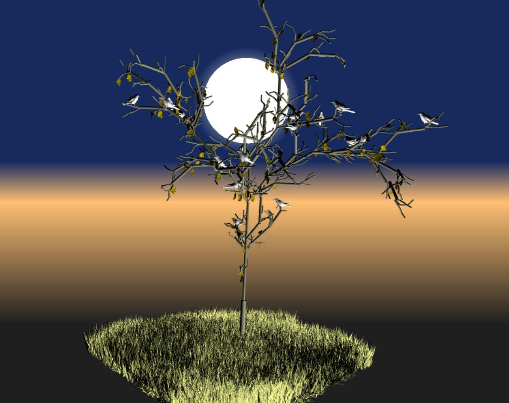
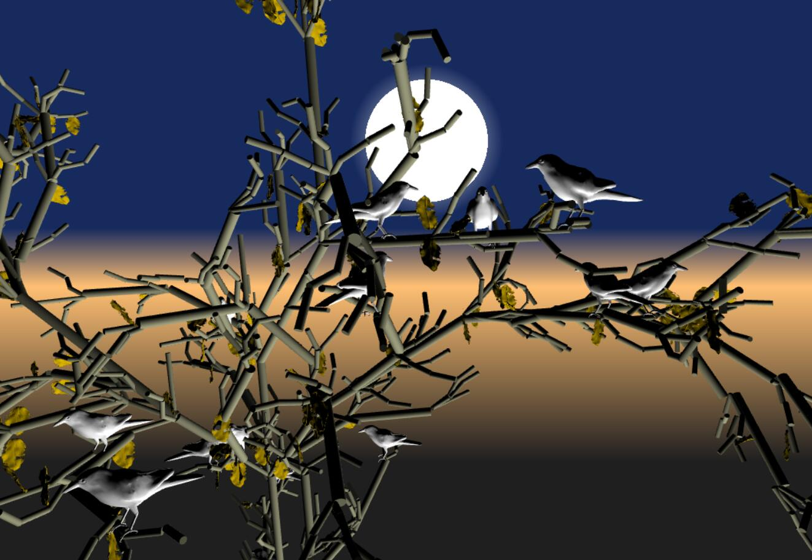

# Homework 4: L-systems

github page demo link: https://yuruwang.github.io/homework-4-l-systems-yuruwang/

Auther: Yuru Wang 

Rules:

F: draw a branch and move turtal forward

B: draw a trunk

X: rotate turtle about X axis with arbitory degree

Y: rotate turtle about Y axis with arbitory degree

Z: rotate turtle about Z axis with arbitory degree

B - BB
F - (70%)FF[YFXFXF][ZFYFYF][XFZFZF] or (30%)FF[YFXFXF][XFZFZF][ZFYFYF]

This tree includes leaves, crows as decorating elements.

Note: 

Please don't close the page unless the server stops responding. (try to reopen the page if so) 

Tweaking parameters like axiom, iteration, noise level will trigger the re-generation of the tree, so it might take some time to finish. If the page crashes, please try again

screen shot:

